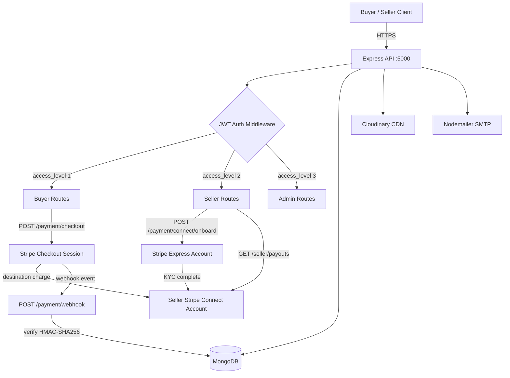
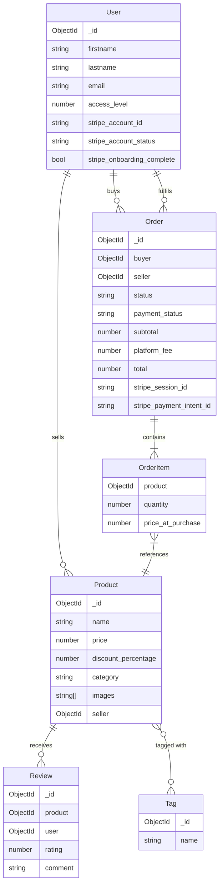
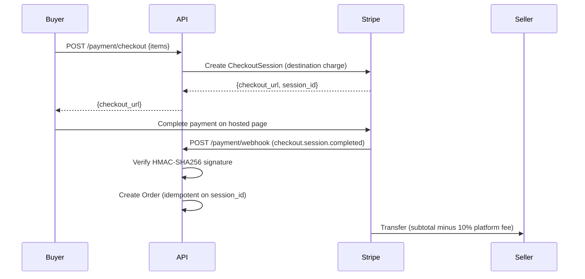

# Ecommerce API

A two-sided e-commerce marketplace API with Stripe Connect integration. Buyers purchase from sellers; the platform collects a configurable fee on every transaction; sellers receive payouts directly to their bank accounts.

## Table of Contents

- [Architecture](#architecture)
- [Features](#features)
- [Tech Stack](#tech-stack)
- [API Reference](#api-reference)
- [Getting Started](#getting-started)
- [Environment Variables](#environment-variables)
- [Project Structure](#project-structure)
- [Data Model](#data-model)
- [Payment Flow](#payment-flow)

---

## Architecture



---

## Features

### Two-Sided Marketplace

- Seller onboarding via Stripe Express Connect accounts with Stripe-hosted KYC
- Buyer checkout using Stripe Checkout Sessions (destination charges)
- Configurable platform fee (default 10%) deducted from every transaction
- Automatic fund transfer to seller's bank account after platform fee
- Seller dashboard with revenue stats, order management, and payout history

### Payments and Security

- Stripe webhook signature verification (HMAC-SHA256) — raw body preserved before `express.json()` runs
- Idempotent order creation: session ID checked before inserting to prevent duplicate orders
- Seller onboarding status kept in sync with Stripe via `account.updated` webhook
- `payment_intent.payment_failed` automatically cancels orders

### Product and User Management

- Role-based access control: buyer (1), seller (2), admin (3)
- Product CRUD with image uploads (Cloudinary), tagging, reviews, and ratings
- JWT access/refresh token authentication with OTP email verification
- Transactional email via Nodemailer and Pug templates

---

## Tech Stack

| Layer | Technology |
|-------|-----------|
| Runtime | Node.js + TypeScript |
| Framework | Express.js |
| Database | MongoDB + Mongoose |
| Payments | Stripe Connect (destination charges, Express accounts) |
| Auth | JWT, bcryptjs, otplib |
| File Uploads | Multer + Cloudinary |
| Email | Nodemailer + email-templates |
| Validation | Celebrate (Joi), express-validator |
| Docs | Swagger UI (`/api/docs`) |

---

## API Reference

### Seller Connect — `/api/payment/connect`

| Method | Endpoint | Auth | Description |
|--------|----------|------|-------------|
| POST | `/onboard` | seller | Create Stripe Connect account and return onboarding URL |
| GET | `/refresh` | seller | Refresh expired onboarding link |
| GET | `/status` | seller | Check `charges_enabled` and `payouts_enabled` |

### Checkout — `/api/payment`

| Method | Endpoint | Auth | Description |
|--------|----------|------|-------------|
| POST | `/checkout` | buyer | Create Stripe Checkout Session (single-seller cart) |
| POST | `/webhook` | — | Stripe event receiver (signature-verified) |

### Seller Dashboard — `/api/seller`

| Method | Endpoint | Auth | Description |
|--------|----------|------|-------------|
| GET | `/dashboard` | seller | Aggregated stats: orders, revenue, products |
| GET | `/orders` | seller | Paginated order list with optional status filter |
| GET | `/payouts` | seller | Stripe payout history and available balance |

### Auth — `/api/auth`

| Method | Endpoint | Description |
|--------|----------|-------------|
| POST | `/register` | Register as buyer or seller |
| POST | `/login` | Authenticate and receive JWT tokens |
| POST | `/verify-otp` | Email OTP verification |
| POST | `/forgot-password` | Initiate password reset |

### Products — `/api/product`

| Method | Endpoint | Auth | Description |
|--------|----------|------|-------------|
| GET | `/` | — | List products (paginated) |
| POST | `/` | seller | Create product with images |
| PATCH | `/:id` | seller | Update product |
| DELETE | `/:id` | seller | Delete product |
| POST | `/:id/reviews` | buyer | Submit a review |

---

## Getting Started

### Prerequisites

- Node.js 18+
- MongoDB
- Stripe account (with Connect enabled)
- Cloudinary account

### Setup

```bash
git clone https://github.com/Olayanju-1234/Ecommerce-theta.git
cd Ecommerce-theta
yarn install
cp .env.example .env   # fill in all values
yarn dev
```

API docs available at `http://localhost:5000/api/docs`

---

## Environment Variables

```env
NODE_ENV=development
PORT=5000
MONGODB_URI=mongodb://localhost:27017/ecommerce

# JWT
JWT_SECRET=your_jwt_secret
REFRESH_TOKEN_SECRET=your_refresh_secret

# Stripe Connect
STRIPE_SECRET_KEY=sk_test_...
STRIPE_WEBHOOK_SECRET=whsec_...
STRIPE_PLATFORM_FEE_PERCENT=10

# Cloudinary
CLOUDINARY_NAME=your_cloud_name
CLOUDINARY_API_KEY=your_api_key
CLOUDINARY_SECRET=your_api_secret

# Email
EMAIL=your@email.com
EMAIL_PASSWORD=your_password
EMAIL_SERVICE=gmail
EMAIL_HOST=smtp.gmail.com
EMAIL_PORT=587
EMAIL_SECURE=false
EMAIL_FROM=your@email.com

# URLs
BASE_URL=http://localhost:5000
APP_URL=http://localhost:3000
```

---

## Project Structure

```
src/
├── config/          # Env validation, DB connection, Swagger
├── controllers/
│   ├── auth.ts      # Auth flows
│   ├── payment.ts   # Stripe Connect onboarding + checkout + webhook
│   ├── product.ts   # Product CRUD
│   ├── seller.ts    # Seller dashboard, orders, payouts
│   └── user.ts      # User profile management
├── middlewares/
│   ├── auth.ts      # JWT auth, isSeller, isAdmin guards
│   └── stripeWebhook.ts  # Raw body collector for webhook verification
├── models/          # Mongoose schemas: User, Product, Order, Review, Tag
├── routes/          # Express routers
├── services/
│   └── Stripe/      # Stripe SDK wrapper (Connect, Checkout, Webhooks)
└── utils/           # Response helpers
```

---

## Data Model



---

## Payment Flow



---

## Live Demo

Frontend: [angular-ecommerce-theta-two.vercel.app](https://angular-ecommerce-theta-two.vercel.app/)
