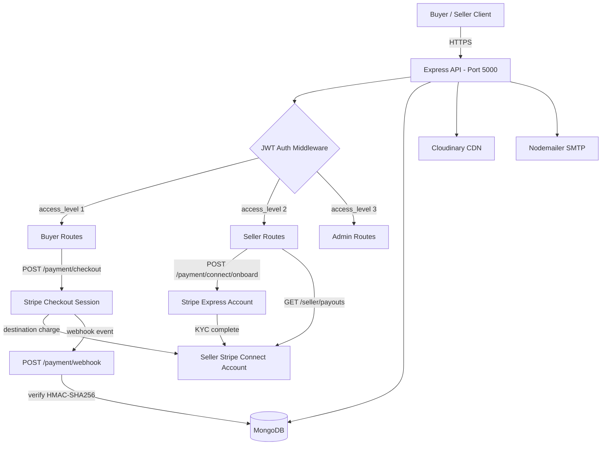
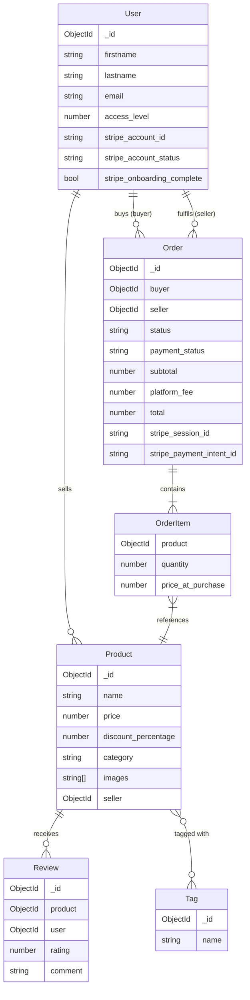
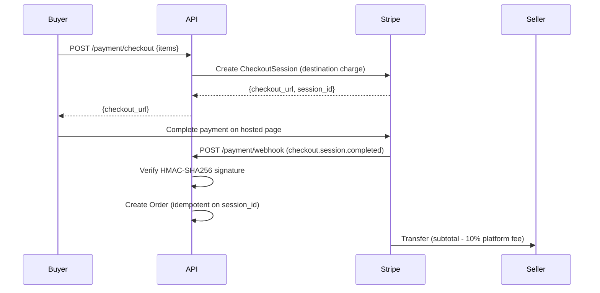

# Ecommerce API

A production-ready two-sided e-commerce marketplace with Stripe Connect integration — buyers purchase from sellers, the platform takes a fee, and sellers receive payouts directly to their bank accounts.

## Architecture

```
Buyer ──POST /checkout──▶ Stripe Checkout Session
                               │  (destination charge: platform fee deducted)
                               ▼
                         Stripe Webhook ──▶ Order created in MongoDB
                               │
                               ▼
                    Seller's Stripe Connect Account
                         (auto-transfer minus 10% platform fee)
```

## Features

### Two-Sided Marketplace
- **Seller onboarding** — Stripe Express Connect accounts with KYC via Stripe-hosted UI
- **Buyer checkout** — Stripe Checkout Sessions with idempotent order creation on payment confirmation
- **Platform fees** — Configurable application fee (default 10%) on every transaction
- **Automatic payouts** — Funds transferred to seller's bank on weekly schedule after platform fee
- **Seller dashboard** — Revenue stats, order management, and Stripe payout history

### Payments & Security
- Stripe webhook signature verification (HMAC-SHA256) — raw body preserved before `express.json()`
- Idempotency on order creation (session ID checked before inserting)
- Replay attack prevention via Stripe's `expires_at` on Checkout Sessions
- Seller onboarding status sync — `account.updated` webhook keeps DB in sync with Stripe
- `payment_intent.payment_failed` cancels orders automatically

### Product & User Management
- Role-based access control — buyer (1), seller (2), admin (3)
- Product CRUD with image uploads (Cloudinary), tagging, reviews, and ratings
- JWT access/refresh token authentication with OTP email verification
- Transactional email via Nodemailer + Pug templates

## Tech Stack

| Layer | Technology |
|-------|-----------|
| Runtime | Node.js + TypeScript |
| Framework | Express.js |
| Database | MongoDB + Mongoose |
| Payments | Stripe Connect (destination charges, Express accounts) |
| Auth | JWT, bcryptjs, otplib |
| File Uploads | Multer + Cloudinary |
| Email | Nodemailer + email-templates |
| Validation | Celebrate (Joi), express-validator |
| Docs | Swagger UI (`/api/docs`) |

## API Overview

### Seller Connect — `/api/payment/connect`

| Method | Endpoint | Auth | Description |
|--------|----------|------|-------------|
| POST | `/onboard` | seller | Create Stripe Connect account + return onboarding URL |
| GET | `/refresh` | seller | Refresh expired onboarding link |
| GET | `/status` | seller | Check `charges_enabled` + `payouts_enabled` |

### Checkout — `/api/payment`

| Method | Endpoint | Auth | Description |
|--------|----------|------|-------------|
| POST | `/checkout` | buyer | Create Stripe Checkout Session (single-seller cart) |
| POST | `/webhook` | — | Stripe event receiver (signature-verified) |

### Seller Dashboard — `/api/seller`

| Method | Endpoint | Auth | Description |
|--------|----------|------|-------------|
| GET | `/dashboard` | seller | Aggregated stats: orders, revenue, products |
| GET | `/orders` | seller | Paginated order list with status filter |
| GET | `/payouts` | seller | Stripe payout history + available balance |

### Auth — `/api/auth`

| Method | Endpoint | Description |
|--------|----------|-------------|
| POST | `/register` | Register buyer or seller |
| POST | `/login` | Authenticate + receive JWT tokens |
| POST | `/verify-otp` | Email OTP verification |
| POST | `/forgot-password` | Password reset initiation |

### Products — `/api/product`

| Method | Endpoint | Auth | Description |
|--------|----------|------|-------------|
| GET | `/` | — | List products (paginated) |
| POST | `/` | seller | Create product with images |
| PATCH | `/:id` | seller | Update product |
| DELETE | `/:id` | seller | Delete product |
| POST | `/:id/reviews` | buyer | Submit review |

## Getting Started

### Prerequisites
- Node.js 18+, MongoDB, Stripe account, Cloudinary account

### Setup

```bash
git clone https://github.com/Olayanju-1234/Ecommerce-theta.git
cd Ecommerce-theta
yarn install
cp .env.example .env   # fill in values
yarn dev
```

API docs at `http://localhost:5000/api/docs`

## Environment Variables

```env
NODE_ENV=development
PORT=5000
MONGODB_URI=mongodb://localhost:27017/ecommerce

# JWT
JWT_SECRET=your_jwt_secret
REFRESH_TOKEN_SECRET=your_refresh_secret

# Stripe Connect
STRIPE_SECRET_KEY=sk_test_...
STRIPE_WEBHOOK_SECRET=whsec_...
STRIPE_PLATFORM_FEE_PERCENT=10

# Cloudinary
CLOUDINARY_NAME=your_cloud_name
CLOUDINARY_API_KEY=your_api_key
CLOUDINARY_SECRET=your_api_secret

# Email
EMAIL=your@email.com
EMAIL_PASSWORD=your_password
EMAIL_SERVICE=gmail
EMAIL_HOST=smtp.gmail.com
EMAIL_PORT=587
EMAIL_SECURE=false
EMAIL_FROM=your@email.com

# URLs
BASE_URL=http://localhost:5000
APP_URL=http://localhost:3000
```

## Project Structure

```
src/
├── config/          # Env validation, DB connection, Swagger
├── controllers/
│   ├── auth.ts      # Auth flows
│   ├── payment.ts   # Stripe Connect onboarding + checkout + webhook
│   ├── product.ts   # Product CRUD
│   ├── seller.ts    # Seller dashboard, orders, payouts
│   └── user.ts      # User profile management
├── middlewares/
│   ├── auth.ts      # JWT auth, isSeller, isAdmin guards
│   └── stripeWebhook.ts  # Raw body collector for webhook signature
├── models/          # Mongoose schemas (User, Product, Order, Review, Tag)
├── routes/          # Express routers
├── services/
│   └── Stripe/      # Stripe SDK wrapper (Connect, Checkout, Webhooks)
└── utils/           # Response helpers
```

## Live Demo

Frontend: [angular-ecommerce-theta-two.vercel.app](https://angular-ecommerce-theta-two.vercel.app/)

---

## Architecture



## Data Model — ERD



## Payment Flow



